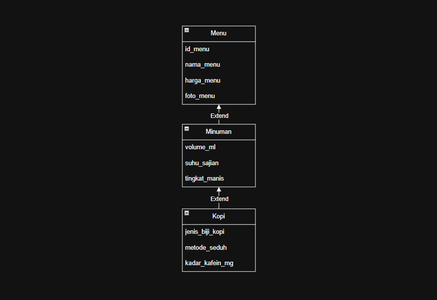
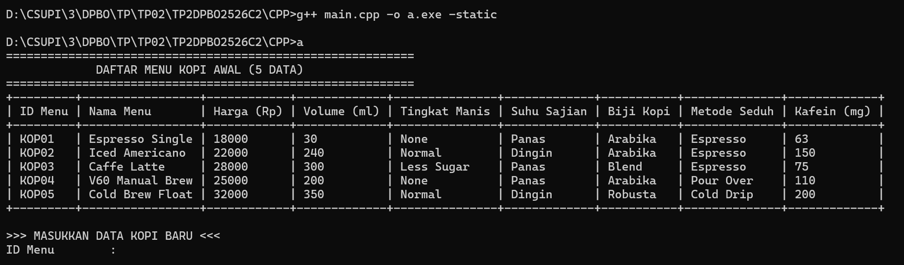
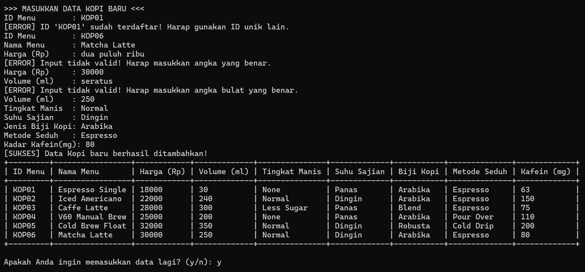
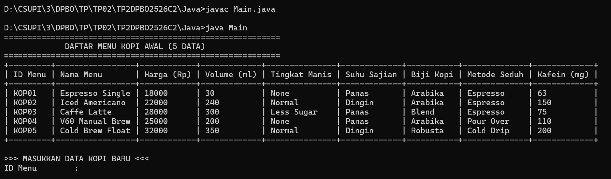
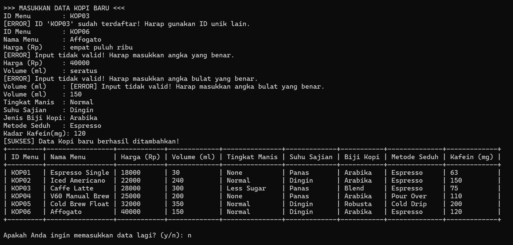
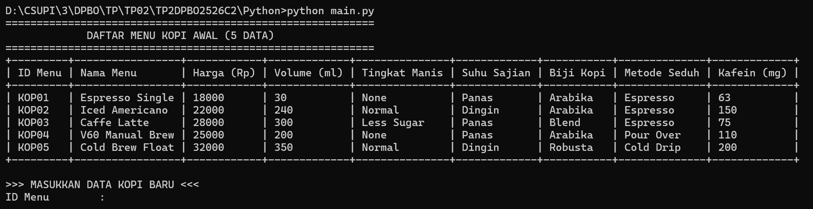
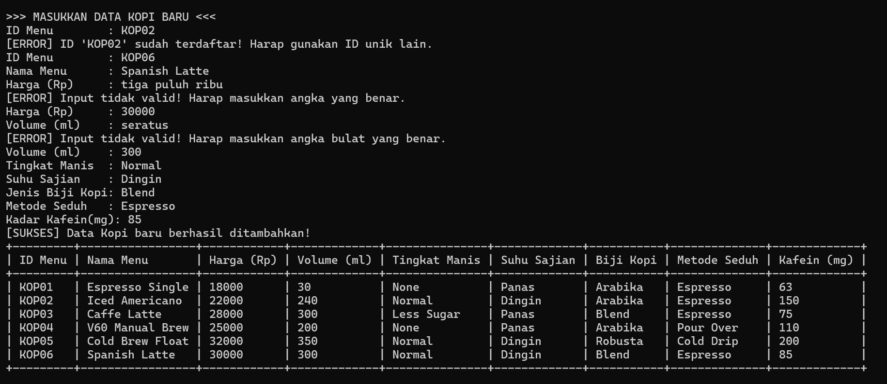
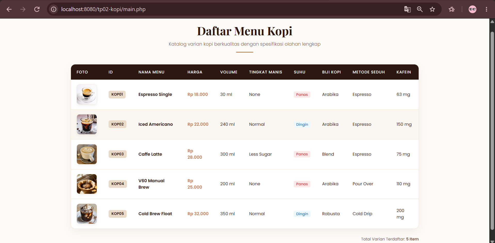

# TP2DPBO2526C2
# Janji 

Saya Moch Fadillah Pratama dengan NIM 2506968 mengerjakan Tugas Praktikum 2 dalam mata kuliah Desain dan Pemrograman Berbasis Objek untuk keberkahan-Nya maka saya tidak melakukan kecurangan seperti yang telah dispesifikasikan. Aamiin.

---

# TP1 DPBO — Katalog Menu Kopi Studio

## Deskripsi Proyek
Proyek ini merupakan sistem informasi katalog menu minuman berbasis Object-Oriented Programming (OOP) yang mengimplementasikan konsep Multi-Level Inheritance (Turunan Bertingkat 3 Level). Sistem ini dirancang untuk mengelola dan menyajikan spesifikasi rinci varian produk kopi pada coffee shop Kopi Studio, mencakup data dasar menu, parameter racikan minuman, hingga rincian biji kopi dan kadar kafein.

Sistem dikembangkan dalam 4 bahasa pemrograman (`C++`, `Java`, `Python`, dan `PHP`) untuk memperlihatkan fleksibilitas penerapan arsitektur kelas berhierarki dan enkapsulasi pada berbagai paradigma runtime.

---

## Struktur Class (Atribut & Method)

Arsitektur sistem dibangun atas 3 tingkatan kelas utama:
1. **`Menu`** *(Base Class / Level 1)*: Menyimpan entitas umum seluruh produk menu.
2. **`Minuman`** *(Intermediary Class / Level 2)*: Turunan dari `Menu`, menyimpan spesifikasi sajian minuman.
3. **`Kopi`** *(Derived Class / Level 3)*: Turunan dari `Minuman`, menyimpan detail olahan biji dan racikan kopi.

### 1. Class `Menu` (Base Class)
* **Atribut:**
  * `id_menu` (`string` / `protected`): ID unik identifikasi produk (contoh: `KOP01`).
  * `nama_menu` (`string` / `protected`): Nama varian menu.
  * `harga_menu` (`double` / `protected`): Harga jual menu dalam Rupiah.
  * `foto_menu` (`string` / `protected` — **Khusus PHP**): Path/lokasi file gambar produk (contoh: `image/foto_espresso_single.jpg`).

* **Method:**
  * `__construct(...)` / `Menu(...)`: Setter nilai awal properti saat instansiasi objek.
  * `getIdMenu()` & `setIdMenu(id)`: Getter & Setter ID menu.
  * `getNamaMenu()` & `setNamaMenu(nama)`: Getter & Setter nama menu.
  * `getHargaMenu()` & `setHargaMenu(harga)`: Getter & Setter harga menu.
  * `getFotoMenu()` & `setFotoMenu(foto)`: Getter & Setter path foto produk (khusus PHP).

### 2. Class `Minuman` (Inherits `Menu`)
* **Atribut:**
  * `volume_ml` (`int` / `protected`): Takaran volume minuman dalam mililiter (ml).
  * `tingkat_manis` (`string` / `protected`): Opsi kadar gula (`None`, `Less Sugar`, `Normal`).
  * `suhu_sajian` (`string` / `protected`): Temperature penyajian (`Panas`, `Dingin`).

* **Method:**
  * `__construct(...)` / `Minuman(...)`: Constructor berantai yang memanggil `parent::__construct()` dari kelas `Menu`.
  * `getVolumeMl()` & `setVolumeMl(volume)`: Getter & Setter volume minuman.
  * `getTingkatManis()` & `setTingkatManis(manis)`: Getter & Setter level manis.
  * `getSuhuSajian()` & `setSuhuSajian(suhu)`: Getter & Setter suhu penyajian.

### 3. Class `Kopi` (Inherits `Minuman`)
* **Atribut:**
  * `jenis_biji_kopi` (`string` / `private`): Varietas biji kopi yang digunakan (`Arabika`, `Robusta`, `Blend`).
  * `metode_seduh` (`string` / `private`): Teknik ekstraksi kopi (`Espresso`, `Pour Over`, `Cold Drip`).
  * `kadar_kafein_mg` (`int` / `private`): Estimasi kandungan kafein dalam miligram (mg).

* **Method:**
  * `__construct(...)` / `Kopi(...)`: Constructor berantai yang memanggil `parent::__construct()` dari kelas `Minuman`.
  * `getJenisBijiKopi()` & `setJenisBijiKopi(biji)`: Getter & Setter varietas biji kopi.
  * `getMetodeSeduh()` & `setMetodeSeduh(metode)`: Getter & Setter teknik ekstraksi.
  * `getKadarKafeinMg()` & `setKadarKafeinMg(kafein)`: Getter & Setter kadar kafein.

---

## Design Diagram & Penjelasan Hubungan Class

### Alasan Hubungan Extends / Inheritance
Hierarki kelas dirancang menggunakan **Multi-Level Inheritance (Turunan 3 Level)** dengan urutan `Menu` $\rightarrow$ `Minuman` $\rightarrow$ `Kopi` berdasar pada prinsip generalisasi ke spesialisasi (*Is-A Relationship*):

1. **`Minuman` extends `Menu`**: 
   * **Generalisasi**: Sebuah toko dapat menjual berbagai tipe menu (seperti makanan, minuman, atau *merchandise*). Kelas `Menu` berperan sebagai entitas dasar abstrak teratas yang menyimpan entitas paling umum yang pasti dimiliki oleh semua barang yang dijual, yaitu ID, Nama, dan Harga.
   * **Spesialisasi**: `Minuman` adalah salah satu kategori khusus (*Is-A*) dari `Menu`. Oleh karena itu, `Minuman` mewarisi properti dasar `Menu` dan menambahkan atribut spesifik yang hanya relevan untuk produk cairan/minuman, seperti takaran volume (`volume_ml`), kadar gula (`tingkat_manis`), dan kondisi penyajian (`suhu_sajian`).

2. **`Kopi` extends `Minuman`**: 
   * **Spesialisasi Tingkat Lanjut**: `Kopi` merupakan turunan lebih spesifik (*Is-A*) dari kelas `Minuman`. Kopi pasti memiliki seluruh sifat dasar minuman (memiliki volume, suhu, dan rasa manis) sekaligus atribut dasar menu (ID, nama, harga).
   * **Atribut Spesifik Kopi**: Kelas `Kopi` menambahkan parameter esensial khusus racikan kopi yang tidak dimiliki oleh minuman non-kopi lainnya (seperti air mineral atau jus), yakni varietas bahan baku (`jenis_biji_kopi`), teknik ekstraksi (`metode_seduh`), serta zat stimulan (`kadar_kafein_mg`).

Dengan struktur *extends* ini, terbentuk penulisan kode yang efisien (*code reusability*), mencegah redundansi deklarasi variabel, serta memastikan enkapsulasi data terorganisir dengan rapi.

---

## Penjelasan Alur Program (Flow & Logic)

### 1. Alur Program C++, Java, & Python (CLI Interaktif)
1. **Inisialisasi Data Awal**: Program pertama kali dieksekusi dengan membentuk *list/array* berisikan beberapa objek `Kopi` awal (data bawaan).
2. **Tambah Data**: Program menerima masukan teks dan angka secara berurutan untuk setiap atribut, lalu menginstansiasi objek `Kopi` baru menggunakan constructor berantai dan memasukkannya ke dalam list.
3. **Lanjutkan**: Program menerima masukan y untuk lanjut dan n untuk tidak lanjut menambah data.

### 2. Alur Program PHP (Web Display)
1. **Pemuatan Class & Instansiasi**: File `main.php` memuat dependensi kelas (`Kopi.php` beserta parent-nya) dan menginstansiasi array dari beberapa objek `Kopi`.
2. **Pemeriksaan File Gambar (`foto_menu`)**: Program mengakses nilai atribut `foto_menu` via method `getFotoMenu()`. Sistem memeriksa ketersediaan file gambar berformat `image/foto_[nama_menu].jpg` menggunakan pustaka internal `file_exists()`. Jika file lokal tidak ditemukan, sistem akan memuat gambar *placeholder fallback*.
3. **Penyajian Data (Render Layout)**: Data dieksekusi menggunakan perulangan `foreach` untuk membentuk baris-baris tabel HTML. Berkas eksternal `style.css` memberikan penataan tata letak (*layouting*), warna tema *coffee warm*, lencana (*badge*) indikator suhu, serta keseragaman ukuran tampilan gambar produk (*aspect ratio* 1:1 / `object-fit: cover`).

---

## Dokumentasi & Tangkapan Layar (Screenshot Output)

Berikut adalah dokumentasi tangkapan layar eksekusi program pada masing-masing bahasa pemrograman:

### 1. Dokumentasi C++ (`Dokumentasi/cpp/`)
* **Screenshot 1 — Tampilan Utama & Read Data**:  
  
* **Screenshot 2 — Tambah & Operasi Data**:  
  

### 2. Dokumentasi Java (`Dokumentasi/java/`)
* **Screenshot 1 — Tampilan Katalog Data**:  
  
* **Screenshot 2 — Input User**:  
  

### 3. Dokumentasi Python (`Dokumentasi/python/`)
* **Screenshot 1 — Menu & Daftar Katalog**:  
  
* **Screenshot 2 — Input User**:  
  

### 4. Dokumentasi PHP (`Dokumentasi/php/`)
* **Screenshot 1 — Halaman Utama Katalog Web & Foto Produk**:  
  
